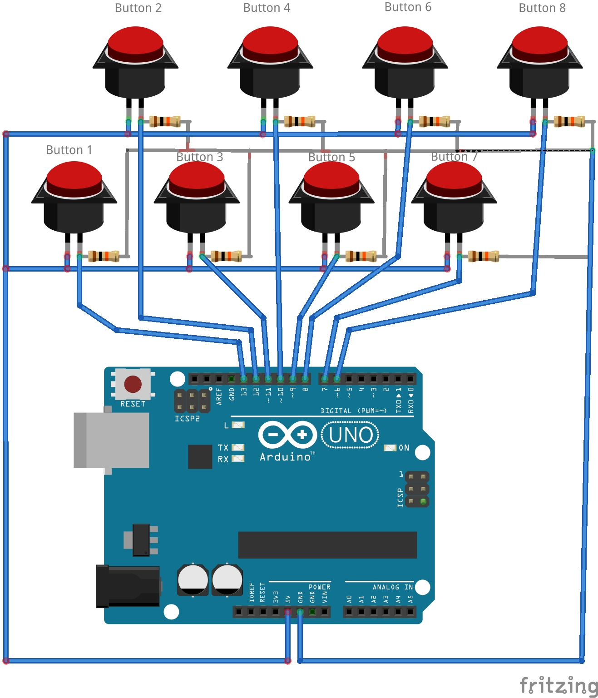
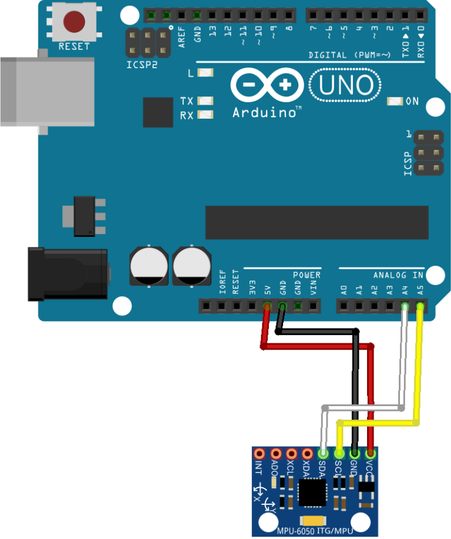

# Examples

With this library several examples are provided:

- 8-Switch Monitoring

- Temperature Monitoring

- Accelero Monitoring


## 8-Switch Monitoring

This example monitors 8 digitalgpio values for incoming buttonpresses and transmits them to the TTN dashboard afterwards.

### Circuit



### Code

```arduino
#include <TheThingsNetwork.h>
#include <CayenneLPP.hpp>

/* The buffer size to initialize the CayenneLPP instance with */
/* For this example a minimum buffer size of 3 is needed, 10 is therefore plenty */
#define BUFFER_SIZE 10

/* The measurement channel from which the measurements were measured
 * Both the data and measurement channel will be bundled and sent over LoraWAN
 * See the README of CayenneLPP
 */
#define MEASUREMENT_CHANNEL 1

#define loraSerial Serial1
#define debugSerial Serial

// Replace REPLACE_ME with TTN_FP_EU868 or TTN_FP_US915
#define freqPlan REPLACE_ME

// Set your AppEUI and AppKey
const char *appEui = "0000000000000000";
const char *appKey = "00000000000000000000000000000000";

TheThingsNetwork ttn(loraSerial, debugSerial, freqPlan);

/* Input pins */
#define NUM_PINS 8
const uint8_t pins[NUM_PINS] = {13, 12, 11, 10, 9, 8, 7, 6};

CayenneLPP::CayenneLPP<BUFFER_SIZE> encoder;

void setup()
{
    loraSerial.begin(57600);
    debugSerial.begin(9600);

    /* Set the pins to input mode */
    for (uint8_t i = 0; i < NUM_PINS; i++)
    {
        pinMode(pins[i], INPUT);
    }

    // Wait a maximum of 10s for Serial Monitor
    while (!debugSerial && millis() < 10000)
        ;

    ttn.join(appEui, appKey);
}

void loop()
{
    CayenneLPP::Measurement_t measurement;
    /* Clear the measurement beforehand! */
    measurement = CayenneLPP::ResetMeasurement();
    /* We don't want to transmit until one pin is high! */
    bool transmit = false;
    for (uint8_t i = 0; i < NUM_PINS; i++)
    {
        /* Read the pin level */
        const uint8_t bit_to_set = digitalRead(pins[i]);
        /* Save the measurement in the measurement struct */
        CayenneLPP::SetRawBit(bit_to_set, &measurement);
        if (bit_to_set)
        {
            /* Button is pushed! Transmit the results after this loop */
            transmit = true;
        }
    }
    if (transmit)
    {
        /* Get the current cursor pos, to know how much bytes to transmit */
        const uint8_t amount_of_bytes = encoder.setMeasurement(MEASUREMENT_CHANNEL, &measurement);
        /* Get the encoder buffer */
        const uint8_t* data = encoder.getBuffer();
        /* Send the bytes to TTN dash */
        ttn.sendBytes(data, amount_of_bytes);
        /* Reset the encoder */
        encoder.reset();
    }
    delay(100);
}

```
## Temperature monitoring

This example samples temperature every second and sends it to the TTN dashboard

### Circuit


### Code
```arduino
// Include the required Arduino libraries:
#include "OneWire.h"
#include "DallasTemperature.h"

#include <TheThingsNetwork.h>
#include <CayenneLPP.hpp>

/* The buffer size to initialize the CayenneLPP instance with */
/* For this example a minimum buffer size of 3 is needed, 10 is therefore plenty */
#define BUFFER_SIZE 10

/* The measurement channel from which the measurements were measured
 * Both the data and measurement channel will be bundled and sent over LoraWAN
 * See the README of CayenneLPP
 */
#define MEASUREMENT_CHANNEL 1

#define loraSerial Serial1
#define debugSerial Serial

// Replace REPLACE_ME with TTN_FP_EU868 or TTN_FP_US915
#define freqPlan REPLACE_ME

// Set your AppEUI and AppKey
const char *appEui = "0000000000000000";
const char *appKey = "00000000000000000000000000000000";

// Define to which pin of the Arduino the 1-Wire bus is connected:
#define ONE_WIRE_BUS 2

// Create a new instance of the oneWire class to communicate with any OneWire device:
OneWire oneWire(ONE_WIRE_BUS);

// Pass the oneWire reference to DallasTemperature library:
DallasTemperature sensors(&oneWire);

TheThingsNetwork ttn(loraSerial, debugSerial, freqPlan);

CayenneLPP::CayenneLPP<BUFFER_SIZE> encoder;

void setup() {
  loraSerial.begin(57600);
  debugSerial.begin(9600);

  // Start up the library:
  sensors.begin();
  ttn.join(appEui, appKey);
}

void loop() {
  CayenneLPP::Measurement_t measurement;
  // Send the command for all devices on the bus to perform a temperature conversion:
  sensors.requestTemperatures();

  // Fetch the temperature in degrees Celsius for device index:
  float tempC = sensors.getTempCByIndex(0); // the index 0 refers to the first device

  /* Set measurement to temperature with measured temperature */
  measurement = CayenneLPP::SetTemperature(tempc);
  
  /* Get the current cursor pos, to know how much bytes to transmit */
  const uint8_t amount_of_bytes = encoder.setMeasurement(MEASUREMENT_CHANNEL, &measurement);
  /* Get the encoder buffer */
  const uint8_t* data = encoder.getBuffer();
  /* Send the bytes to TTN dash */
  ttn.sendBytes(data, amount_of_bytes);
  /* Reset the encoder */
  encoder.reset();
  // Wait 1 second:
  delay(1000);
}
```

## Accelero Monitoring

This example samples accelero every second and sends it to the TTN dashboard

### Circuit



### Code
```arduino
// Include the required Arduino libraries:
#include <Adafruit_MPU6050.h>
#include <Adafruit_Sensor.h>
#include <Wire.h>

#include <TheThingsNetwork.h>
#include <CayenneLPP.hpp>

/* The buffer size to initialize the CayenneLPP instance with */
#define BUFFER_SIZE 50

/* The measurement channel from which the measurements were measured
 * Both the data and measurement channel will be bundled and sent over LoraWAN
 * See the README of CayenneLPP
 */
#define MEASUREMENT_CHANNEL 1

#define loraSerial Serial1
#define debugSerial Serial

// Replace REPLACE_ME with TTN_FP_EU868 or TTN_FP_US915
#define freqPlan REPLACE_ME

// Set your AppEUI and AppKey
const char *appEui = "0000000000000000";
const char *appKey = "00000000000000000000000000000000";

Adafruit_MPU6050 mpu;

TheThingsNetwork ttn(loraSerial, debugSerial, freqPlan);

CayenneLPP::CayenneLPP<BUFFER_SIZE> encoder;

void setup() {
  loraSerial.begin(57600);
  debugSerial.begin(9600);

 if (!mpu.begin()) {
    debugSerial.println("Failed to find MPU6050 chip");
    while (1) {
      delay(10);
    }
  }
  
  mpu.setAccelerometerRange(MPU6050_RANGE_8_G);
  mpu.setGyroRange(MPU6050_RANGE_500_DEG);
  mpu.setFilterBandwidth(MPU6050_BAND_5_HZ);
ttn.join(appEui, appKey);
}

void loop() {
  CayenneLPP::Measurement_t measurement;
  sensors_event_t a, g, temp;
  mpu.getEvent(&a, &g, &temp);

  /* Set measurement to gyro with measured gyro */
  measurement = CayenneLPP::SetGyro(g.x, g.y, g.z);
  
  /* Place the gyro measurement in the encoder buffer */
  encoder.setMeasurement(MEASUREMENT_CHANNEL, &measurement);

  /* Set measurement to accelero with measured accelero */
  measurement = CayenneLPP::SetAcceleration(a.x, a.y, a.z);

  /* Place the accelero measurement in the encoder buffer */
  encoder.setMeasurement(MEASUREMENT_CHANNEL, &measurement);

  /* Set measurement to temperature with measured temperature */
  measurement = CayenneLPP::SetTemperature(temp.temperature);

  /* Get the current cursor pos, to know how much bytes to transmit */
  const uint8_t amount_of_bytes = encoder.setMeasurement(MEASUREMENT_CHANNEL, &measurement);
  /* Get the encoder buffer */
  const uint8_t* data = encoder.getBuffer();
  /* Send the bytes to TTN dash */
  ttn.sendBytes(data, amount_of_bytes);
  /* Reset the encoder */
  encoder.reset();
  // Wait 1 second:
  delay(1000);
}
```